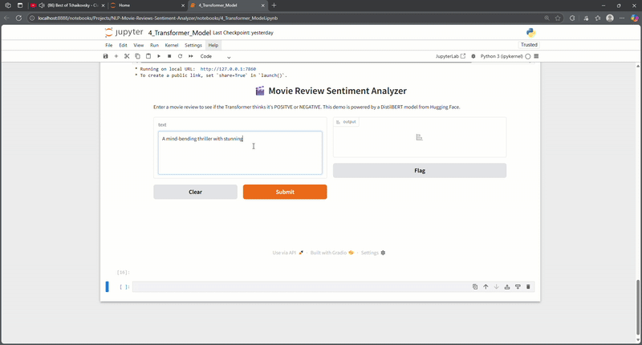

# NLP Movie Review Sentiment Analyzer

This project builds and compares three different machine learning models to classify movie reviews as either positive or negative. The entire workflow, from data cleaning to final model evaluation and an interactive demo, is documented in a series of Jupyter Notebooks.

## Project Goal
The objective of this project was to apply the complete lifecycle of a Natural Language Processing project to a real-world problem. The goal was to develop a high-performance sentiment analysis model, starting with a simple baseline and progressively iterating with more advanced architectures to achieve a high degree of precision and recall.

## Dataset
This project uses the **IMDB Dataset of 50K Movie Reviews**, a public dataset available on Kaggle. It is perfectly balanced with 25,000 positive and 25,000 negative reviews, making it an excellent benchmark for binary classification.

## Methodology
The project followed a systematic, multi-step approach, with each step documented in a separate notebook:

1.  **Data Exploration and Cleaning:** The raw data was loaded, explored, and found to contain HTML tags and other noise. A robust preprocessing pipeline was built using `spaCy` to clean and lemmatize the text. A key strategic decision was made to **not** remove stop words, allowing the N-gram model to capture important contextual phrases.

2.  **Baseline Model:** A classic NLP model was built using a `TfidfVectorizer` (with 1, 2, and 3-grams) and a `LogisticRegression` classifier. This provided a strong baseline F1-score/Accuracy to beat.

3.  **Simple Neural Model:** A simple feed-forward neural network (`MLPClassifier`) was trained using pre-trained 300-dimension word vectors from `spaCy`'s `en_core_web_md` model to test the hypothesis that semantic features would improve performance.

4.  **Transformer model:** A pre-trained **Transformer** model (`DistilBERT` from the Hugging Face library) was implemented to leverage a deep contextual understanding of language.

## Final Results
A key part of the process was scaling the analysis from a 1,000-review sample (for rapid development) to the full 50,000-review dataset for the final robust results.

| Model Performance (on 1,000-review sample) | F1-Score (Weighted Avg) |
| ------------------------------------------ | ----------------------- |
| Baseline (TF-IDF + N-grams)                | 0.71                    |
| Simple NN (Word Vectors)                   | 0.70                    |
| **State-of-the-Art (Transformer)** | **0.89** |

The most significant finding is that the classic **TF-IDF + N-gram baseline** when trained on the full dataset, perfomed identically to the **transformer model**

The table below shows the definitve weighted average F1-scores and Accuracy¹ for all three models after being trained and tested on the full dataset. The F1-score is the primary metric as it provides a balanced measure of precision and recall.

| Model (on Full 50,000 Dataset) | Accuracy | F1-Score (Weighted Avg) |
| ------------------------------------------ | -------- | ----------------------- |
| **Baseline (TF-IDF + N-grams)** | **0.89** | **0.89** |
| Simple NN (Word Vectors)                   | 0.77     | 0.77                    |
| **State-of-the-Art (Transformer)** | **0.89** | **0.89** |

**¹ The equality between the Accuracy and the weighted average F1-score is a mathematical property observed in this specific case due to the test dataset being perfectly balanced (equal number of positive and negative samples).**

The final result of this project are fascinating. Trough the experimentation with three different model architectures,it was possible to test the designed solutions and deploy finally the best performing one.

The main takeaway from the project is that the baseline model, created using TF-IDF with N-grams on a cleaned dataset, performs at the same level as the transformer model with both achieving a final F-1 Score of 0.89 and an Accuracy of 0.89. The Simple neural network using Word vectors underformed both with a F1-Score of 0.77.

## Interactive Demo
An interactive demo was built using `Gradio` to allow for real-time sentiment analysis of custom text. To run it, execute the final cells in the `4_Transformer_Model_FINAL.ipynb` notebook.

## How to Run 
1.  **Clone the repository:** `git clone https://github.com/LouisGreive/NLP-Movie-Reviews-Sentiment-Analyzer.git`
2.  **Install all necessary libraries:** `pip install -r requirements.txt`
3.  **Run the notebooks:** The project is documented in two sets of notebooks:
    * **Development Notebooks (`1_...` to `4_...`):** These notebooks use a 1,000-review sample for fast, iterative development and debugging.
    * **Final Notebooks (`..._FINAL.ipynb`):** These are the final versions of the models, run on the full 50,000-review dataset to generate the official results.

The notebooks are numbered and should be run in order.
